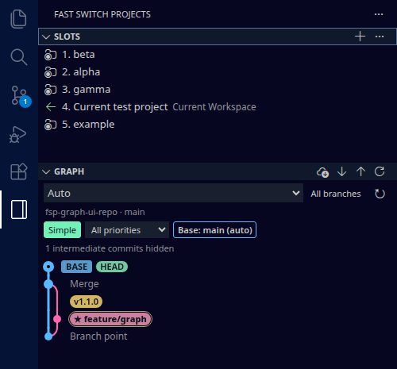
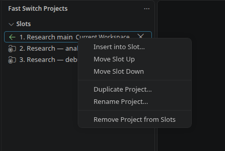
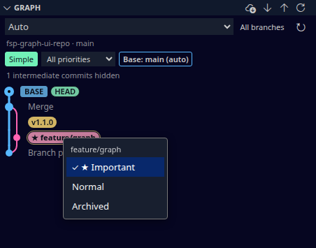

# Fast Switch Projects

Switching between projects in VS Code is not easy. The [Projects extension](https://github.com/L13/vscode-projects) provides a convenient way to organize and open projects, but switching projects requires reloading the current window, which can be slow.

Fast Switch Projects builds on Projects with ordered project slots and faster switching. It keeps each project open in its own VS Code window, then switches focus between those windows—avoiding unnecessary workspace reloads. Projects can be reordered by dragging them in the Slots view.

## Features

- Browse Git history in an independent **Graph** pane below Slots.
- Focus on branch endpoints and merges in **Simple** view, or switch to full commit history.
- Distinguish branches by color, highlight the default/base branch, and mark important or archived branches.
- View branch and tag labels, commit details, and file diffs; fetch, pull, or push the selected repository.
- Keep as many ordered project slots as you need.
- Open slots 1 through 9 directly with keyboard chords.
- Navigate every occupied slot with next, previous, first, and last commands.
- Reorder slots by dragging rows or using keyboard-friendly move commands.
- Insert a workspace, group, or tag at any slot without overwriting another assignment.
- Add projects directly from the Slots header; each project receives the next available slot.
- Right-click a project to duplicate it into a separate window over the same files, or rename its slot.
- Remove projects directly from their slot rows and close the numbering gap automatically.
- Add folders or `.code-workspace` files, with optional automatic opening in separate windows.
- Synchronize project data and slot changes across open VS Code windows.
- Export and import projects, groups, tags, favorites, and slot assignments as JSON.

## Installation

For the Windows prototype, install **one file** locally:
`fast-switch-projects-windows-0.2.0.vsix`, using **Extensions: Install from VSIX...**.
The package includes native window management and project engine 1.5.4. It
sets up that engine automatically for local and Remote-SSH workspaces. Users do
not need another VSIX, build tools, or a manual server installation. Trust your
workspaces if prompted, and reload when requested during an upgrade.

For Remote-SSH, first install Microsoft's Remote-SSH extension and establish a
working connection. The bundled project engine runs on the SSH host, while window
management runs on Windows. No `remote.extensionKind` override is needed. The
engine can appear separately in Extensions; the Windows package manages its setup.

These prototype builds are not published to the Marketplace. Share the Windows
VSIX directly. Building it is documented in [GUIDE.md](GUIDE.md#build-the-preview).
Git pushes and Marketplace publication remain separate steps.

Fast Switch Projects has its own extension, command, view, and setting identifiers.
It can be installed independently from Projects by L13. The extensions retain
some overlapping default shortcuts; configure those if using both.

## Quick start

1. Open Fast Switch Projects with `Ctrl+L Ctrl+I` (`Cmd+L Cmd+I` on macOS).
2. Click **+** in the **Slots** header and choose a project folder. It is added to the end of the list automatically.
3. Drag slot rows to reorder them. Click a row or use its shortcut to switch projects.
4. Click **×** on a row, or right-click and choose **Remove Project from Slots**, to remove it. Later slots move up to close the gap. Project files and open windows remain intact.

The Slots header's **…** menu also provides **Add Workspace Project...** for `.code-workspace` files and **Add Current Project to Slots**. Adding an already listed project leaves its position unchanged; adding a saved but unlisted project puts it back in the next slot.

The sidebar contains only **Slots** and **Graph**. Existing slots, shortcuts, imported group/tag slots, and backup data remain compatible; there is no separate Workspaces panel or group-assignment step.

## Duplicate and rename projects

Right-click a project in **Slots** and choose **Duplicate Project...**, then enter a name. The duplicate is appended to Slots and opens in its own window. Each copy has a separate workspace identity, so clicking its slot returns to that window. Duplication always opens a new window, regardless of the settings for adding or opening ordinary projects.

Both windows edit the **same source files and Git branch**. They can maintain separate editor layouts and workspace settings; running terminals and unsaved editor buffers are not copied. To work on independent files or branches, add a separate checkout as another project.

Choose **Rename Project...** to change the name in Slots. This leaves the source folder, slot position, and workspace identity intact. For duplicates, the window title also follows the new name. Both actions are available in the Command Palette and apply to individual project slots.

Duplicates use small `.code-workspace` files in the extension host's global storage, under `project-workspaces/`. When copying an existing workspace, folder references are resolved from the original location; settings, tasks, launch configurations, and comments are retained, with a new window title. No source files or symlinks are created in your repository.

Removing a duplicate removes its slot and registration, leaving its workspace file and open window intact. You can re-add it from that window with **Add Current Project to Slots**. JSON exports contain project paths, not the generated workspace files: back up the `project-workspaces` directory as well when migrating to another host.

## Git graph

The **Graph** pane belongs to Fast Switch Projects and appears below **Slots**. It adapts VS Code's open-source graph drawing code into an independent webview that can be customized without changing VS Code's built-in Source Control view.

- **Auto** follows the active editor's repository, falling back to the first open repository. Choose a repository to pin it.
- **All branches** is the default and includes all local refs plus detached HEAD. **Current** shows HEAD, its upstream, and the selected base branch history. An explicitly saved scope choice is preserved.
- Click a commit to see its message and changed files, then click a file to open a VS Code diff. Merge commits show changes against their first parent.
- The graph header provides **Fetch**, **Pull**, **Push**, and **Refresh**. Network and working-tree operations run only when you click their commands, using the selected repository's normal Git configuration. Creating upstream branches and resolving conflicts remain in Source Control.
- Repository selection and branch scope are remembered per workspace. The graph refreshes when Git state changes, the view becomes visible, or the window regains focus. While visible, it also checks references every two seconds to catch branch changes made in a terminal or sibling worktree. Unchanged history is not redrawn.
- **Load more commits** extends history by `fastSwitchProjects.graph.pageSize` (default 200), up to 5000 commits.

The graph requires Git, the enabled built-in Git extension, and a trusted workspace. On Remote SSH it runs on the remote workspace host, alongside Git. Project and slot data keep the same extension identifier and VS Code profile storage. The graph shows repositories open in the current window; switching project windows shows that window's repositories.

Customization entry points are `media/graph/graph.css` (appearance), `media/graph/graph.js` (interactions), `media/graph/scmGraph.js` (SVG drawing), `src/graph/layout.ts` (branch lanes), `src/graph/simplify.ts` (collapsed history), and `src/graph/importance.ts` (priority filters). See [LICENSE-VSCODE.txt](LICENSE-VSCODE.txt) for the pinned upstream source and MIT notice. This pane includes the core history workflow; native graph context menus and synthetic incoming/outgoing rows are not copied.

### Base branch

Graph marks the default branch with a **BASE** badge and a thicker blue line through its first-parent history. HEAD continues to mark the checked-out commit. Merged feature histories keep their own colors.

Click **Base: …** above the graph to select another local or remote branch, or choose **Auto** to restore detection. This display preference is saved per repository in the current workspace and survives reloads; it does not switch branches or change Git history.

Auto uses locally recorded remote HEAD (preferring origin), then falls back to main or master. If no default is known, select one manually. A deleted manual selection is shown as unavailable until you choose another. Current mode includes HEAD, its upstream, and the base branch.

### Simple graph

Graph defaults to **Simple**: branch endpoints, HEAD, merges, branch points, and the start or boundary of the loaded history. Intermediate linear commits collapse into connecting lines; these lines can therefore span multiple commits. Duplicate remote labels at the same local branch tip are hidden. Click a node for its original commit message and file changes.

Click **Simple** to switch to **Full** commit history, or **Full** to simplify it again. The choice survives reloads. Load more commits to extend the history beyond the current boundary.

### Branch importance

Branch labels use distinct, softened colors that persist across refreshes and reloads. Matching local and remote labels share a color.

Right-click a branch label (including BASE) and choose **Important**, **Normal**, or **Archived**. Important branches get a star and outline; archived labels fade. Local and remote labels of the same branch share a priority.

Use **All priorities**, **Hide archived**, or **Important only** above the graph. Filters operate on the loaded history and preserve the current branch, base branch, and connecting ancestry, including merges. Select All priorities to restore hidden labels or change an archived branch back to Normal.

Priorities are local preferences stored under the repository's Git common directory in `fast-switch-projects/importance/`. Linked worktrees share them and visible graphs update automatically. These files do not enter normal commits, merges, or pushes, and archiving never deletes a branch. Separate clones and servers keep independent preferences.

## Keyboard shortcuts

| Action | Windows/Linux | macOS |
| --- | --- | --- |
| Open Fast Switch Projects | `Ctrl+L Ctrl+I` | `Cmd+L Cmd+I` |
| Open slots 1–9 | `Ctrl+L Ctrl+1` … `Ctrl+L Ctrl+9` | `Cmd+L Cmd+1` … `Cmd+L Cmd+9` |
| Next occupied slot | `Ctrl+L Ctrl+J` | `Cmd+L Cmd+J` |
| Previous occupied slot | `Ctrl+L Ctrl+K` | `Cmd+L Cmd+K` |
| First occupied slot | `Ctrl+L Ctrl+A` | `Cmd+L Cmd+A` |
| Last occupied slot | `Ctrl+L Ctrl+E` | `Cmd+L Cmd+E` |
| Previous workspace | `Ctrl+L Ctrl+0` | `Cmd+L Cmd+0` |

Slots above 9 remain available by clicking them or running **Fast Switch Projects: Open Slot...** from the Command Palette.

## Slot organization

The **Slots** view displays occupied entries only. Drag a row onto another row to move it to that position and shift the intervening slots. Drop a row on empty space below the list to move it to the end.

The following commands are also available:

- **Fast Switch Projects: Insert into Slot...**
- **Fast Switch Projects: Open Slot...**
- **Fast Switch Projects: Move Slot Up**
- **Fast Switch Projects: Move Slot Down**
- **Fast Switch Projects: Remove Project from Slots**

Workspace, workspace-group, and tag slots all support the same ordering operations.

## Settings

| Setting | Default | Purpose |
| --- | --- | --- |
| `fastSwitchProjects.openInNewWindow` | `false` | Open a selected existing project in a new window. |
| `fastSwitchProjects.openNewProjectsInNewWindow` | `true` | Open projects selected with **Add Project...** or **Add Workspace Project...** in new windows after registration. |
| `fastSwitchProjects.useCacheForDetectedProjects` | `false` | Cache automatically detected workspaces between sessions. |
| `fastSwitchProjects.confirmOpenMultipleWindows` | `true` | Confirm before opening several workspaces at once. |

Additional settings control project discovery, ignored folders, workspace sorting, labels, icons, and status-bar behavior.

## Backup and migration

Run **Fast Switch Projects: Export Data...** to create a JSON backup and **Fast Switch Projects: Import Data...** to restore it. Import replaces the extension's current stored data after confirmation.

Because Fast Switch Projects has a new extension identifier, data from the development-only Ordered Projects build is not transferred automatically. Export from Ordered Projects before uninstalling it, then import the JSON file into Fast Switch Projects.

## Compatibility

- Visual Studio Code 1.69 or newer.
- Local folders, Remote SSH folders, and VS Code workspace files.
- Limited operation in untrusted workspaces; status-bar color customization follows VS Code Workspace Trust restrictions.

See [GUIDE.md](GUIDE.md) for detailed behavior and build instructions.

## Support

Report Fast Switch Projects issues at [AgeYY/fast-switch-projects](https://github.com/AgeYY/fast-switch-projects/issues).

## Credits and license

Fast Switch Projects is independently maintained and is based on the open-source [Projects extension by L13|RARY](https://github.com/L13/vscode-projects). It is not affiliated with or endorsed by the original author.

The original work is copyright © 2019–2023 L13|RARY. Subsequent modifications are copyright © 2026 AgeYY. See the bundled `LICENSE` file for the software license and [LICENSE-ICONS.md](LICENSE-ICONS.md) for third-party icon notices.

### Open every listed project

Run **Fast Switch Projects: Open All Listed Projects** from the Command Palette, or
choose it from the Slots view menu. It opens unique projects in slot order, including
projects inside listed groups and tags. Separate workspace files remain separate
sessions, even when they reference the same folder. The current window stays open.
The command pauses single-window hiding so all opened windows can remain visible.
It does not register projects automatically. Use the progress notification to stop
launching further windows; already opened windows stay open.

### Open and register the entire list

Run **Fast Switch Projects: Open and Register All Listed Projects** from the
Command Palette or Slots menu (Windows Companion 0.1.2 required locally). It saves
approval for the listed workspace identities and opens their windows. Already
running and newly opened approved windows register automatically. It reports
registration progress and pending startup/trust requirements, while leaving
hiding paused. Then run **Enable Single Visible Window Mode** in the desired
active window. Unlisted windows remain unmanaged. **Unregister This Project
Window** revokes approval persistently; cancellation stops further opens but
retains approvals already saved for the list.

### Single Windows installation

The Windows distribution is `fast-switch-projects-windows-0.2.0.vsix`. Install
only that package locally using **Extensions: Install from VSIX...**. It bundles
window management and project engine 1.5.4, automatically installing the engine
locally or on the connected Remote-SSH host/profile as appropriate. Remote-SSH
itself and a working SSH connection remain prerequisites. Trust workspaces when
prompted; an update of an already active engine can require a window reload.
The engine can appear separately in Extensions, but requires no separate user
installation. Existing project and registration identities are preserved.
