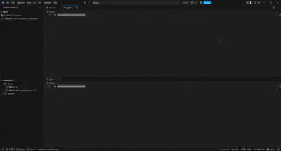

# Fast Switch Projects

Switching between projects in VS Code is not easy. The [Projects extension](https://github.com/L13/vscode-projects) provides a convenient way to organize and open projects, but switching projects requires reloading the current window, which can be slow.

Fast Switch Projects builds on Projects with ordered project slots and faster switching. It keeps each project open in its own VS Code window, then switches focus between those windows—avoiding unnecessary workspace reloads. Projects can be reordered by dragging them in the Slots view.



## Features

- Keep as many ordered project slots as you need.
- Open slots 1 through 9 directly with keyboard chords.
- Navigate every occupied slot with next, previous, first, and last commands.
- Reorder slots by dragging rows or using keyboard-friendly move commands.
- Insert a workspace, group, or tag at any slot without overwriting another assignment.
- Place newly added projects in the first custom group and the next available slot automatically.
- Open projects selected with **Add Project...** or **Add Workspace Project...** in separate new windows.
- Synchronize project data and slot changes across open VS Code windows.
- Export and import projects, groups, tags, favorites, and slot assignments as JSON.

## Installation

Search for **Fast Switch Projects** in the VS Code Extensions view or install it by identifier:

```text
ZeyuanYe.fast-switch-projects
```

For manual installation, run **Extensions: Install from VSIX...** and select the packaged `fast-switch-projects-1.0.0.vsix` file.

Fast Switch Projects has its own extension, command, view, and setting identifiers. It can be installed independently from Projects by L13. The extensions retain overlapping default keyboard shortcuts, so disable or reassign one set of shortcuts if both extensions are enabled.

## Quick start

1. Open the Fast Switch Projects activity-bar view with `Ctrl+L Ctrl+I` (`Cmd+L Cmd+I` on macOS).
2. In **Workspaces**, select **Add Project...**.
3. Choose one or more folders. Each new project is placed in the first custom group, assigned the next slot, and opened in a separate window.
4. In **Slots**, drag rows into the order you want.
5. Use a slot shortcut or click a slot to switch projects.

When no custom group exists, the extension creates one named **Projects**. **Save Project...** records the currently open project without opening a duplicate window.

## Keyboard shortcuts

| Action | Windows/Linux | macOS |
| --- | --- | --- |
| Open Fast Switch Projects | `Ctrl+L Ctrl+I` | `Cmd+L Cmd+I` |
| Open slots 1–9 | `Ctrl+L Ctrl+1` … `Ctrl+L Ctrl+9` | `Cmd+L Cmd+1` … `Cmd+L Cmd+9` |
| Next occupied slot | `Ctrl+L Ctrl+J` | `Cmd+L Cmd+J` |
| Previous occupied slot | `Ctrl+L Ctrl+K` | `Cmd+L Cmd+K` |
| First occupied slot | `Ctrl+L Ctrl+A` | `Cmd+L Cmd+A` |
| Last occupied slot | `Ctrl+L Ctrl+E` | `Cmd+L Cmd+E` |
| Previous workspace | `Ctrl+L Ctrl+0` | `Cmd+L Cmd+0` |

Slots above 9 remain available by clicking them or running **Fast Switch Projects: Open Slot...** from the Command Palette.

## Slot organization

The **Slots** view displays occupied entries only. Drag a row onto another row to move it to that position and shift the intervening slots. Drop a row on empty space below the list to move it to the end.

The following commands are also available:

- **Fast Switch Projects: Insert into Slot...**
- **Fast Switch Projects: Open Slot...**
- **Fast Switch Projects: Move Slot Up**
- **Fast Switch Projects: Move Slot Down**
- **Fast Switch Projects: Remove Slot and Close Gap**

Workspace, workspace-group, and tag slots all support the same ordering operations.

## Settings

| Setting | Default | Purpose |
| --- | --- | --- |
| `fastSwitchProjects.openInNewWindow` | `false` | Open a selected existing project in a new window. |
| `fastSwitchProjects.openNewProjectsInNewWindow` | `true` | Open projects selected with **Add Project...** or **Add Workspace Project...** in new windows after registration. |
| `fastSwitchProjects.useCacheForDetectedProjects` | `false` | Cache automatically detected workspaces between sessions. |
| `fastSwitchProjects.confirmOpenMultipleWindows` | `true` | Confirm before opening several workspaces at once. |

Additional settings control project discovery, ignored folders, workspace sorting, labels, icons, and status-bar behavior.

## Backup and migration

Run **Fast Switch Projects: Export Data...** to create a JSON backup and **Fast Switch Projects: Import Data...** to restore it. Import replaces the extension's current stored data after confirmation.

Because Fast Switch Projects has a new extension identifier, data from the development-only Ordered Projects build is not transferred automatically. Export from Ordered Projects before uninstalling it, then import the JSON file into Fast Switch Projects.

## Compatibility

- Visual Studio Code 1.69 or newer.
- Local folders, Remote SSH folders, and VS Code workspace files.
- Limited operation in untrusted workspaces; status-bar color customization follows VS Code Workspace Trust restrictions.

See [GUIDE.md](GUIDE.md) for detailed behavior and build instructions.

## Support

Report Fast Switch Projects issues at [AgeYY/fast-switch-projects](https://github.com/AgeYY/fast-switch-projects/issues).

## Credits and license

Fast Switch Projects is independently maintained and is based on the open-source [Projects extension by L13|RARY](https://github.com/L13/vscode-projects). It is not affiliated with or endorsed by the original author.

The original work is copyright © 2019–2023 L13|RARY. Subsequent modifications are copyright © 2026 AgeYY. See [LICENSE.md](LICENSE.md) for the software license and [LICENSE-ICONS.md](LICENSE-ICONS.md) for third-party icon notices.
